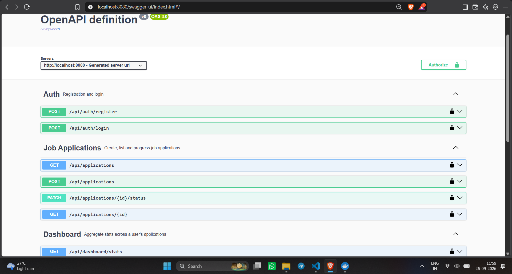
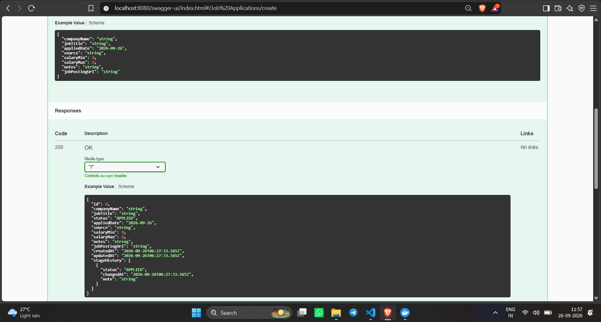
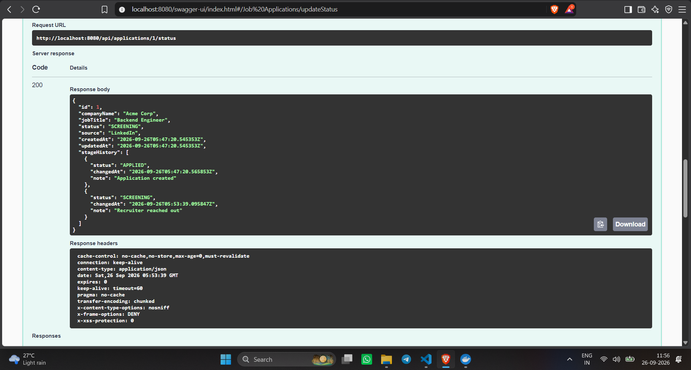
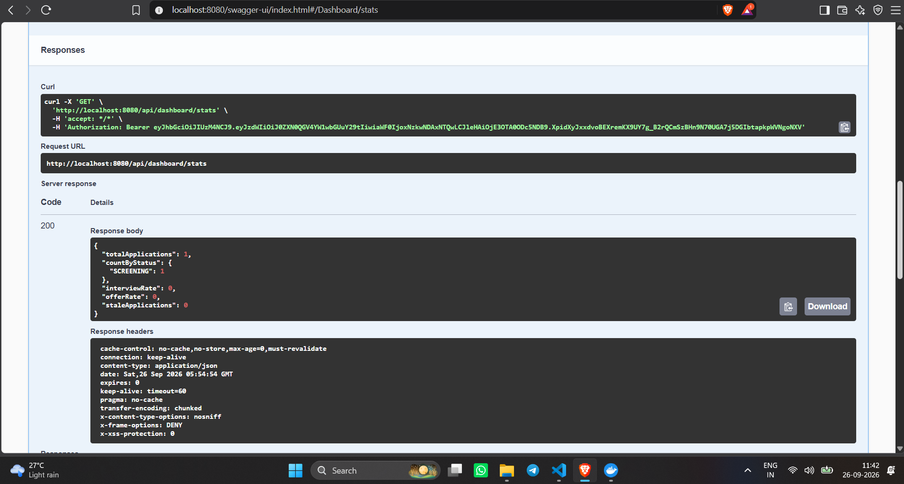

# Job Application Tracker


A backend REST API for tracking job applications through their full lifecycle — applied, screening, interviewing, offered, rejected, or withdrawn — with a status timeline, interview scheduling, and dashboard analytics.

Built as a portfolio project with **Java 21 language level / JDK 27 runtime** and **Spring Boot 3.3**.

## Why this project

Most CRUD portfolio projects stop at create/read/update/delete. This one also demonstrates:

- **Modern Java**: records for DTOs, a **sealed interface** (`StatusTransitionResult`) with an **exhaustive pattern-matching switch** to enforce valid status transitions (e.g. a rejected application can never silently become "offered").
- **Virtual threads** enabled for request handling (`spring.threads.virtual.enabled`).
- **JWT auth** with Spring Security, stateless sessions, BCrypt password hashing.
- **Audit trail**: every status change is appended to `application_stage_history`, not overwritten — so you get a real timeline per application.
- **Aggregate analytics**: interview rate, offer rate, and "stale" applications (no update in 14+ days) computed via a dashboard endpoint.

## Tech stack

- Java 21 (compiles/runs on JDK 27 — fully backward compatible)
- Spring Boot 3.3 (Web, Data JPA, Security, Validation)
- PostgreSQL (via Docker) / H2 for tests
- JWT (jjwt)
- springdoc-openapi (Swagger UI)
- JUnit 5, Mockito, AssertJ

## API Overview

| Method | Endpoint | Description |
|--------|----------|--------------|
| GET | `/api/applications?status=&company=&from=&to=&page=&size=` | Search and filter your applications (paginated) |
| POST | `/api/applications/{id}/interviews` | Schedule an interview |
| GET | `/api/applications/{id}/interviews` | List interviews for an application |
| PATCH | `/api/interviews/{id}/feedback` | Add interview feedback |
| GET | `/api/companies`, `/api/companies/{id}` | Companies referenced by applications |
| POST / GET | `/api/companies/{id}/contacts` | Add / list contacts at a company |

Full interactive docs at `/swagger-ui.html` once running.

## Running locally

**Prerequisites:** JDK 21+, Maven, Docker Desktop

```bash
# 1. Start Postgres
docker compose up -d

# 2. Run the app
mvn spring-boot:run

# 3. Open Swagger UI
http://localhost:8080/swagger-ui.html
```

## Example flow

```bash
# Register
curl -X POST http://localhost:8080/api/auth/register \
  -H "Content-Type: application/json" \
  -d '{"email":"jane@example.com","password":"supersecure123","fullName":"Jane Doe"}'

# Login (grab the token from the response)
curl -X POST http://localhost:8080/api/auth/login \
  -H "Content-Type: application/json" \
  -d '{"email":"jane@example.com","password":"supersecure123"}'

# Create an application (replace TOKEN)
curl -X POST http://localhost:8080/api/applications \
  -H "Authorization: Bearer TOKEN" \
  -H "Content-Type: application/json" \
  -d '{"companyName":"Acme Corp","jobTitle":"Backend Engineer","source":"LinkedIn"}'

# Move it forward
curl -X PATCH http://localhost:8080/api/applications/1/status \
  -H "Authorization: Bearer TOKEN" \
  -H "Content-Type: application/json" \
  -d '{"status":"SCREENING","note":"Recruiter call scheduled"}'

# Dashboard stats
curl http://localhost:8080/api/dashboard/stats -H "Authorization: Bearer TOKEN"
```

## Design highlight: status transitions

Status changes aren't just a field update — they're validated business rules modeled with a **sealed interface** and an **exhaustive pattern-matching switch**:

```java
public sealed interface StatusTransitionResult
        permits StatusTransitionResult.Accepted, StatusTransitionResult.Rejected {
    record Accepted(ApplicationStatus from, ApplicationStatus to) implements StatusTransitionResult {}
    record Rejected(ApplicationStatus from, ApplicationStatus attempted, String reason) implements StatusTransitionResult {}
}
```

Rules enforced: a `REJECTED` or `WITHDRAWN` application is terminal (no further changes), and an `OFFERED` application can only move to `WITHDRAWN`. The compiler guarantees every branch of the sealed hierarchy is handled — no risk of a silently-unhandled case.

## Running tests

Includes unit tests for the status-transition rules (Mockito) and an end-to-end MockMvc test covering auth, ownership, filtering and dashboard stats.

## What's next

- Send real email notifications from the daily stale-application job (it currently logs)
- Resume/cover-letter upload via multipart + S3-compatible storage
- Rate-limiting on `/api/auth/login`
- Deploy to a cloud host for a live demo link

## Screenshots

### API Overview


### Creating an Application


### Status Transition with Audit Trail


### Dashboard Analytics
